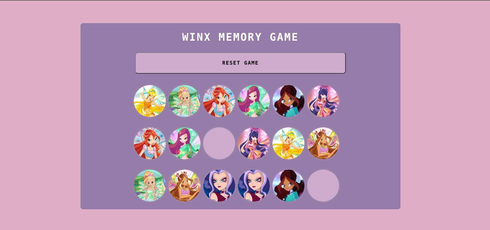

# WINX - Memory Game

Jogo da memória das Winx, versão 1.0

## Resumo do projeto

O projeto consiste em um jogo da memória interativo baseado nas personagens Winx, onde o jogador é desafiado a encontrar pares correspondentes de cartas viradas para baixo. As cartas são exibidas aleatoriamente e o jogador deve clicar em duas cartas por vez para revelar suas imagens. Se as imagens forem correspondentes, as cartas permanecem viradas para cima; caso contrário, elas são viradas de volta após um breve intervalo. O objetivo é encontrar todos os pares correspondentes, virando todas as cartas no jogo.

## Recursos e Funcionalidades:

**Interface Gráfica Divertida:** Design atraente com cartas representando as personagens do desenho Winx, trazendo uma experiência visual nostálgica.

**Interatividade do Usuário:** Capacidade de clicar nas cartas para revelar suas imagens, tornando a experiência do jogo dinâmica e envolvente.

**Lógica de Jogo:** Desenvolvimento da lógica para verificar se as cartas viradas formam um par correspondente, proporcionando um desafio de memória e concentração.

**Mensagem de Vitória:** Exibição de uma mensagem de vitória quando todos os pares correspondentes foram encontrados com uma conclusão satisfatória ao jogo.

## Tecnologias Utilizadas:

- HTML, CSS e JavaScript para a estrutura, estilo e interatividade.
- Uso de arrays para armazenar caminhos de imagens das cartas.
- Manipulação do DOM para criar e interagir com elementos HTML.
- Implementação de lógica de jogo para verificar correspondências e determinar a vitória.

# Meus aprendizados nesse projeto:

**1. Manipulação do DOM:**
Melhorei o meu entendimento de como interagir com o DOM utilizando JavaScript para criar, modificar e exibir elementos HTML.

**2. Trabalho com Arrays:**
Compreendi melhor como utilizar arrays para armazenar e acessar dados, ex: os caminhos das imagens das cartas.

**3. Lógica de Jogo:**
Desenvolvi melhor minhas habilidades na criação de uma lógica de jogo, incluindo a verificação de correspondências e condições de vitória.

**4. Controle de Eventos:**
Lidar com eventos do usuário, como cliques, para criar interatividade e resposta às ações do jogador.

**5. Animações CSS:**
Implementação de animações CSS para melhorar a experiência visual do jogo, como as animações de virar as cartas.

**6. Resolução de Conflitos:**
Enfrentamento de situações de conflitos no código.

**7. Integração de Recursos Visuais:**
Integração de elementos visuais para aprimorar a experiência do usuário e criar uma atmosfera divertida no jogo.

**8. Autenticidade e Criatividade:**
Exploração da oportunidade de expressar autenticidade e criatividade ao criar um projeto temático das Winx.

## Objetivo do Projeto:

O projeto visa oferecer uma experiência de jogo divertida e desafiadora, incentivando a prática de habilidades de lógica e memória. É uma aplicação que aborda conceitos: como manipulação de arrays, eventos do DOM e controle de fluxo em JavaScript.

## Etiquetas

## Próximas Funcionalidades (Futuras Atualizações)

**1. Níveis de Dificuldade:**

Introduza diferentes níveis de dificuldade, ajustando o número de cartas ou o tempo disponível para memorização.

**2. Efeitos Sonoros Interativos:**

Efeitos sonoros interativos para cada ação no jogo, como virar uma carta, encontrar um par correspondente ou concluir com sucesso uma partida.

**3. Temporizador de Jogo:**

Introduzir um temporizador para tornar o jogo mais desafiador, onde os jogadores têm um limite de tempo para concluir cada partida.

**4. Animar a Conclusão:**

Ao concluir uma partida, animar a tela para proporcionar uma experiência mais gratificante.

**5. Sistema de Conquistas:**

Implementar um sistema de conquistas para recompensar os jogadores por realizar certas tarefas ou alcançar marcos específicos.

**6. Sistema de Pistas ou Power-ups:**

Introduzir alguma carta especial, que concede ao jogador pistas ou power-ups úteis durante o jogo.

**7. Sistema de Ajuda:**

Adicionar dicas ou ajuda para que os jogadores possam usar durante o jogo para revelar temporariamente algumas cartas.
